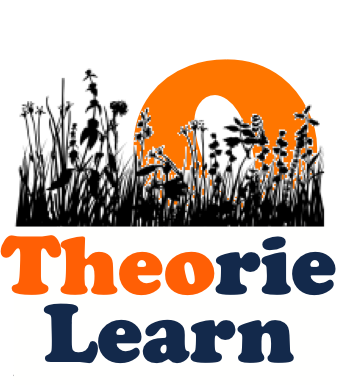

 

### Publications

* Jason Xia and Craig Zilles.  [Using context-free grammars to scaffold and automate feedback in precise mathematical writing](https://doi.org/10.1145/3545945.3569728).  _Proc. 54th SIGSCE_, 479–485, 2023.

* Jeff Erickson, Jason Xia, Eliot Wong Robson, Tue Do, Aidan Glickman, Zhuofan Jia, Eric Jin, Jiwon Lee, Patrick Lin, Steven Pan, Samuel Ruggerio, Tomoko Sakurayama, Andrew Yin, Yael Gertner, and Brad Solomon.  [Auto-graded scaffolding exercises for theoretical computer science
](https://jeffe.cs.illinois.edu/pubs/pl4tcs.html).  To appear in _Proc. 2023 ASEE Annual Conference_, 2023.

### Products
* [CS 374 Github repository](https://github.com/jeffgerickson/pl-uiuc-cs374)
* [Public practice instance of CS 374](https://www.prairielearn.org/pl/course_instance/129595)
* Elements createed by our project that have since been migrated into the main PrairieLearn repo:
   * [`pl-big-o-input`](https://prairielearn.readthedocs.io/en/latest/elements/#pl-big-o-input-element)
   * [`pl-hidden-hints`](https://prairielearn.readthedocs.io/en/latest/elements/#pl-hidden-hints-element)

### Credits

* Instigator: Jason Xia 
* Chief Software Architect (since Fall 2021): Eliot Robson 
* Director (since Fall 2021): Jeff Erickson
* Co-director (since Fall 2022): Carl Evans

**Developers:**
* Spring 2021: Patrick Lin, Jason Xia
* Fall 2021: Julie Lee, Steven Pan, Eliot Robson, Tomoko Sakurayama, Jason Xia
* Spring 2022: Eric Jin, Eliot Robson, Sam Ruggerio, Jason Xia, Andrew Yin
* Summer 2022: Eliot Robson, Sam Ruggerio
* Fall 2022: Ben Clarage, Tue Do, Aidan Glickman, Zhuofan Jia, Eric Jin, Eliot Robson, Sam Ruggerio, Andrew Yin
* Spring 2023: Anshul Bheemreddy, Ben Clarage, Tue Do, Zhuofan Jia, Eric Jin, Eliot Robson, Sam Ruggerio

**Instructors** that have used resources in this repository in their courses:
* CS 374:
  * Spring 2021: Chandra Chekuri and Patrick Lin
  * Fall 2021: Jeff Erickson and Dakshita Khurana
  * Spring 2022: Timothy Chan and Ruta Mehta
  * Fall 2022: Sariel Har-Peled
  * Spring 2023: Chandra Chekuri
  * Fall 2023: Jeff Erickson
* CS 225 (since Fall 2022): Carl Evans and Brad Solomon
* CS 173 (since Fall 2022): Benjamin Cosman
* CS 401 and CS 403 (since Spring 2023): Yael Gertner
* CS 277 (since Spring 2023): Brad Solomon

**Funding:**
Since August 2022, this project has been funded by the Grainger College of Engineering, through the [Strategic Instructional Innovations Program](https://ae3.engineering.illinois.edu/siip-grants/), under the auspices of the [Academy for Excellence in Engineering Education](https://ae3.engineering.illinois.edu/).  The faculty members of the SIIP team are Jeff Erickson (PI), Carl Evans, Yael Gertner, Brad Solomon, and Tiffani Williams.  Our AE3 liaison is Yuting Chen.

**Other Acknowledgments:**
Many thanks to the core PrairieLearn development team, espeially Dave Mussulman, Seth Poulson, Nathan Walters, and Matt West.  FInally, we thank the roughly 3500 students in CS 374, CS 225, and CS 173 who have used these resources, for their patience, frustration, and helpful feedback.
