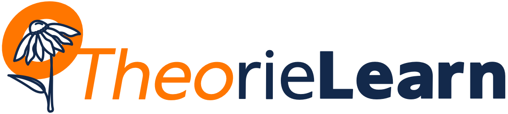

We are a team developing resources on the PrairieLearn platform to support the teaching of algorithms, data structures, and other theoretical aspects of computer science, at several different levels of the computer science curriculum at the University of Illinois.  This development effort started with [CS 374](https://courses.engr.illinois.edu/cs374al1/fa2023/) (Algorithms and Models of Computation), but has since expanded to include several other classes at Illinois, including [CS 173](https://courses.engr.illinois.edu/193/sp2023/) (Discrete Structures), [CS 225](https://courses.engr.illinois.edu/cs225/fa2023/) (Data Structures}, [CS 277](https://courses.engr.illinois.edu/cs277/sp2023/) (Algorithms and Data Structures for [Data Science](https://datascience.illinois.edu/)), and [CS 401](https://cs.illinois.edu/academics/courses/cs401)/[403](https://cs.illinois.edu/academics/courses/cs403) (Accelerated Fundamentals of Algorithms).

### Publications

* Jason Xia and [Craig Zilles](https://zilles.cs.illinois.edu/).  [Using context-free grammars to scaffold and automate feedback in precise mathematical writing](https://doi.org/10.1145/3545945.3569728).  _Proc. 54th SIGSCE_, 479–485, 2023.

* [Jeff Erickson](https://jeffe.cs.illinois.edu/), Jason Xia, Eliot Wong Robson, Tue Do, Aidan Glickman, Zhuofan Jia, Eric Jin, Jiwon Lee, Patrick Lin, Steven Pan, [Samuel Ruggerio](https://surg.dev/), Tomoko Sakurayama, Andrew Yin, [Yael Gertner](https://ygertner.web.illinois.edu/), and [Brad Solomon](https://publish.illinois.edu/bradsol/).
[Auto-graded scaffolding exercises for theoretical computer science](https://jeffe.cs.illinois.edu/pubs/pl4tcs.html).
_Proc. 2023 ASEE Annual Conference_, 2023.

* Caleb Evans and [Eliot W. Robson](https://eliotwrobson.github.io/).
[automata: A Python package for simulating and manipulating automata](https://joss.theoj.org/papers/10.21105/joss.05759).
_J. Open Source Software_ 8(90):5759, 2023.

* [Eliot W. Robson](https://eliotwrobson.github.io/),
[Samuel Ruggerio](https://surg.dev/),
and [Jeff Erickson](https://jeffe.cs.illinois.edu/).
[FSM Builder: A tool for writing autograded finite automata questions](https://dl.acm.org/doi/10.1145/3649217.3653599).
_Proc. 29th ITiCSE_, 269–275, 2024.

* Hongxuan Chen,
  [Katherine Braught](https://katherinebraught.github.io/),
  [Geoffrey L. Herman](https://publish.illinois.edu/glherman/), 
  and [Jeff Erickson](https://jeffe.cs.illinois.edu/).
[Novice difficulties in graph layering for algorithm design](https://doi.org/10.1145/3641555.3705221).
_Proc. 56th SIGCSE, v. 2_, 2025. Poster abstract.  [[Local copy](http://jeffe.cs.illinois.edu/pubs/layering.html)]

### Demos

* [Public practice instance of CS 374](https://www.prairielearn.org/pl/course_instance/129595)
* Contributed to the [Spiffy Questions with PrairieLearn](https://www.prairielearn.com/sigcse2024) workshop at [SIGCSE 2024](https://sigcse2024.sigcse.org/)
* 🚧 Public course repository (code MIT Licence; text CC-BY) coming soon

### Products

* [CS 374 Github repository](https://github.com/jeffgerickson/pl-uiuc-cs374) (private)
   * 🎁 **We are happy to provide access to our Github repository to interested instructors!**
* Elements createed by our project that have since been migrated into PrairieLearn proper include
   * [`pl-big-o-input`](https://prairielearn.readthedocs.io/en/latest/elements/#pl-big-o-input-element)
   * [`pl-hidden-hints`](https://prairielearn.readthedocs.io/en/latest/elements/#pl-hidden-hints-element)
* Contributions to the [automata](https://github.com/caleb531/automata) Python library
* In development:
   * [Graph/state builder element](https://github.com/Surg-Dev/graph-state-builder-pl), based in part on [Evan Wallace's fsm](https://github.com/evanw/fsm) <!-- and [Caleb Evans' automata](https://github.com/caleb531/automata).-->

### Credits

* Instigator: Jason Xia 
* Chief Software Architect (since Fall 2021): [Eliot Robson](https://eliotwrobson.github.io/)
* Director (since Fall 2021): [Jeff Erickson](https://jeffe.cs.illinois.edu/)
* Co-director (since Fall 2022): [Carl Evans](https://cs.illinois.edu/about/people/faculty/gcevans)
* Research assistants: [Eliot Robson](https://eliotwrobson.github.io/) and Hongxuan Chen

**Developers:**
* Fall 2024: Eli Kujawa, [Eliot Robson](https://eliotwrobson.github.io/), Elisa Carillo, Nathan Omerza, Yuqing Zhai
* Spring 2024: Alex Jin, Dhiraj Kuttichirayil, Eli Kujawa, [Eliot Robson](https://eliotwrobson.github.io/), George Huber, Nathan Omerza, Vedaant Jain, Yuqing Zhai
* Fall 2023: Alex Jin, Dhiraj Kuttichirayil, [Eliot Robson](https://eliotwrobson.github.io/), Nathan Omerza, Riya Verma, Yuqing Zhai
* Spring 2023: Anshul Bheemreddy, Ben Clarage, Tue Do, Zhuofan Jia, Eric Jin, [Eliot Robson](https://eliotwrobson.github.io/), Sam Ruggerio
* Fall 2022: Ben Clarage, Tue Do, Aidan Glickman, Zhuofan Jia, Eric Jin, [Eliot Robson](https://eliotwrobson.github.io/), Sam Ruggerio, Andrew Yin
* Summer 2022: [Eliot Robson](https://eliotwrobson.github.io/), Sam Ruggerio
* Spring 2022: Eric Jin, [Eliot Robson](https://eliotwrobson.github.io/), Sam Ruggerio, Jason Xia, Andrew Yin
* Fall 2021: Julie Lee, Steven Pan, Eliot Robson, Tomoko Sakurayama, Jason Xia
* Spring 2021: Patrick Lin, Jason Xia

**Instructors** that have used resources in this repository in their courses:
* CS 374:
  * Spring 2021: Chandra Chekuri and Patrick Lin
  * Fall 2021: [Jeff Erickson](https://jeffe.cs.illinois.edu/) and Dakshita Khurana
  * Spring 2022: Timothy Chan and Ruta Mehta
  * Fall 2022: Sariel Har-Peled
  * Spring 2023: Chandra Chekuri
  * Fall 2023: [Jeff Erickson](https://jeffe.cs.illinois.edu/)
  * Spring 2024: Timothy Chan and Ruta Mehta
  * Fall 2024: Sariel Har-Peled
  * Spring 2025: Chandra Chekuri and James Hulett
* CS 225 (since Fall 2022): [Carl Evans](https://cs.illinois.edu/about/people/faculty/gcevans) and [Brad Solomon](https://publish.illinois.edu/bradsol/)
* CS 173:
  * Fall 2022–Spring 2024: Benjamin Cosman
  * Fall 2024: [Carl Evans](https://cs.illinois.edu/about/people/faculty/gcevans)
* CS 401 and CS 403 (since Spring 2023): [Yael Gertner](https://ygertner.web.illinois.edu/)
* CS 277 (since Spring 2023): Brad Solomon

**Funding:**

* This project is primarily funded by the Grainger College of Engineering, through the [Strategic Instructional Innovations Program](https://ae3.engineering.illinois.edu/siip-grants/), under the auspices of the [Academy for Excellence in Engineering Education](https://ae3.engineering.illinois.edu/), with matching funds from the Department of Computer Science (now the Siebel Schhol of Computing and Data Science) since July 2023.  The current faculty members of the SIIP team are
[Jeff Erickson](https://jeffe.cs.illinois.edu/) (PI),
[Carl Evans](https://cs.illinois.edu/about/people/faculty/gcevans),
[Yael Gertner](https://ygertner.web.illinois.edu/),
and [Brad Solomon](https://publish.illinois.edu/bradsol/);
the 2022–23 startup SIIP team also included Tiffani Williams.

  * [2022-2023 startup proposal](proposals/TheorieLearn-SIIP-2022.pdf) — AE3 Liaison: Yuting Chen
  * [2023-2024 proposal](proposals/TheorieLearn-SIIP-2023.pdf) — AE3 Liaison: Mariana Silva
  * [2024-2025 renewal](proposals/TheorieLearn-SIIP-2024.pdf) — AE3 Liaison: Mattox Beckman
 
* 🔥 [Related research](https://www.canonlab.org/theoryabcs) is funded by NSF grant CNS-2434363. “Theory-ABCs: Transforming online theory instruction while building ability, belonging, and confidence”, led by [Diana Franklin](https://people.cs.uchicago.edu/~dmfranklin/) (Univerity of Chicago),
with [Jeff Erickson](https://jeffe.cs.illinois.edu/) (Illinois PI),
[Yael Gertner](https://ygertner.web.illinois.edu/),
[Geoffrey Herman](https://publish.illinois.edu/glherman/) (Illinois co-PI),
and [Seth Poulsen](https://sethpoulsen.github.io/) (Utah State PI).

**Other Acknowledgments:**
Many thanks to the core PrairieLearn development team, especially Dave Mussulman, Seth Poulson, Nathan Walters, and Matt West.  FInally, we thank the roughly 3500 students in CS 374, CS 225, and CS 173 who have used these resources, for their patience, frustration, and helpful feedback.
